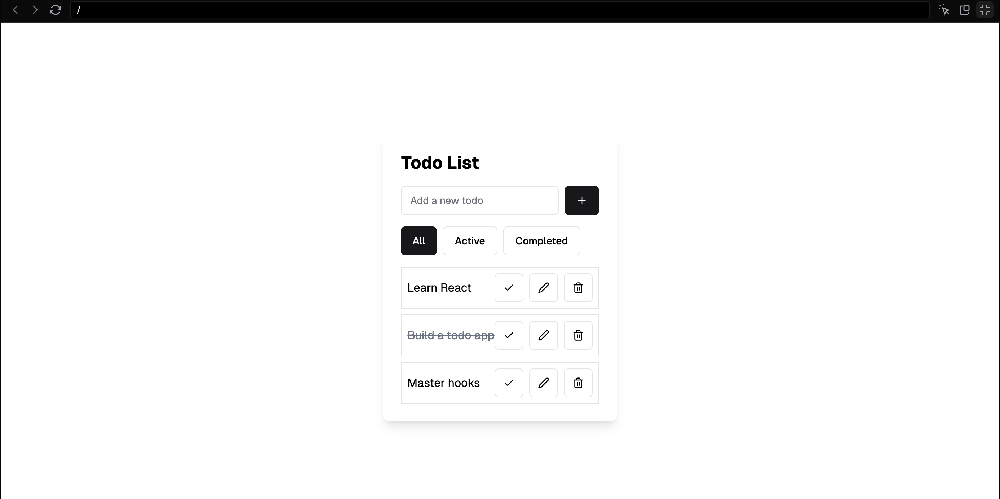

# Todo List Application Requirements

## Fullstack Requirements

You are tasked with creating a simple todo list application using React, TypeScript, and optionally TailwindCSS on the Frontend and Node, TypeScript, Express, Postgres, and one of the following ORMs: Drizzle, Prisma, node-pg. Please implement the following features:

1. Display a list of todos
2. Add new todos
3. Delete todos
4. Implement basic styling to match the provided design (see design below)

Bonus Features (if time allows):

5. Mark todos as completed
6. Filter todo by status (All, Active, Completed)
7. Edit existing todos

## Frontend Only Requirements

You are tasked with creating a simple todo list application using React. Please implement the following features:

1. Display a list of todo items
2. Add new todo items
3. Delete todo items
4. Mark todo items as completed
5. Filter todo items (All, Active, Completed)
6. Implement basic styling to match the provided design

Bonus features (if time allows):

7. Edit existing todo items
8. Persist todos in local storage
9. Implement basic form validation (e.g., prevent empty todos)

Note: Focus on functionality first. If time permits, improve the styling and UI/UX based on design instructions below.

## Todo List Application Design

Please refer to the provided design above as a guide for your implementation. Your goal is to create a functional todo list application that closely resembles this design. Key points to note:

1. The application should have a clean, centered layout with a white background and subtle shadow.
2. Include an input field for adding new todos, along with an "Add" button.
3. Implement filter buttons for "All", "Active", and "Completed" todos.
4. Each todo item should display the todo text and have buttons for completing, editing, and deleting the todo.
5. Completed todos should have a strikethrough effect.
6. Use appropriate spacing and styling to ensure good readability and user experience.

Note: While matching the exact design is not crucial, aim to create a clean and functional user interface that incorporates all the required features.
